# STM32 CAN Pedal-Dashboard ECU Simulator

## Project Overview

This project implements a CAN-based ECU simulator using two STM32 Nucleo-F446RE boards.

One board acts as a Pedal ECU, reading an analog pedal input using ADC and transmitting the pedal percentage over CAN.

The other board acts as a Dashboard ECU, receiving pedal data through CAN and printing the received value through UART. Later, the Dashboard ECU will control LED output based on the received pedal value.

---

## Hardware

- STM32 Nucleo-F446RE x2
- SN65HVD230 CAN Transceiver x2
- 10kΩ Potentiometer
- LED
- 120Ω termination resistor x2
- Breadboard and jumper wires
- Logic Analyzer

---

## Development Environment

- STM32CubeIDE
- STM32CubeMX
- Tera Term
- Windows

---

## Features

- UART debug output
- ADC pedal input reading
- PWM LED control
- CAN message transmission and reception
- Timeout detection
- Fail-safe LED behavior
- Non-blocking super loop structure

---

## Current Progress

- [x] STM32 LED Blink
- [x] USART2 UART output to PC using ST-LINK Virtual COM Port
- [x] Register-level UART test
- [x] HAL-based UART output
- [x] ADC input reading using potentiometer
- [x] ADC value output through UART
- [x] Convert ADC value to pedal percentage
- [x] PWM LED control
- [x] CAN transmit
- [x] CAN receive
- [x] Transmit ADC-based pedal percentage over CAN
- [x] Receive CAN pedal data and print it through UART
- [x] Dashboard PWM control using received CAN data
- [x] Control Dashboard ECU LD2 brightness using received pedal data
- [x] Timeout and fail-safe logic
- [x] CAN timeout detection after message loss
- [x] Fail-safe LED OFF behavior on CAN timeout
- [x] CAN restored detection after communication recovery
- [x] Non-blocking CAN transmission using HAL_GetTick
- [x] Removed HAL_Delay from Pedal ECU transmit loop
- [x] Non-blocking Dashboard ECU receive loop
- [x] CAN timeout check using HAL_GetTick
- [x] Refactored CAN ID, timeout, and PWM values using define
- [ ] Final demo

---

## CAN Communication Summary

The Pedal ECU reads the potentiometer value through ADC and converts it into a pedal percentage from 0 to 100%.

The pedal percentage is transmitted through CAN using standard CAN ID `0x100`.

```text
CAN ID: 0x100
DLC: 1 byte
Data[0]: Pedal percentage, 0~100
CAN1_TX: PB9
CAN1_RX: PB8
Bitrate: 500 kbps
```

The Dashboard ECU receives the CAN frame and prints the received pedal value through UART.

---

## Demo

### ADC Test

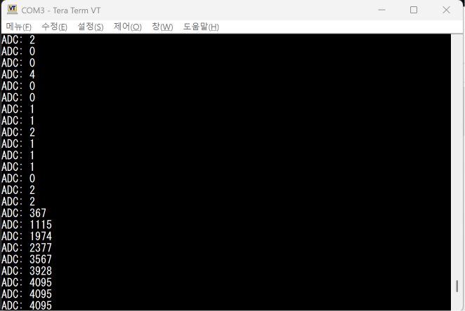

### CAN Pedal Transmission Test

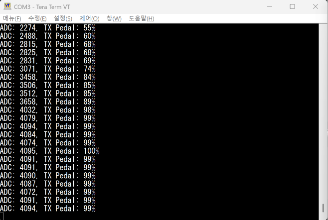

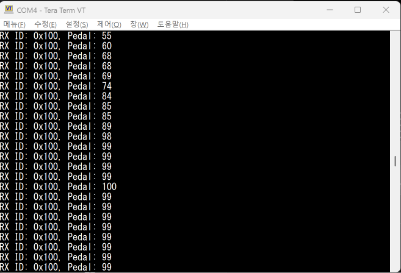

### CAN Bus Wiring

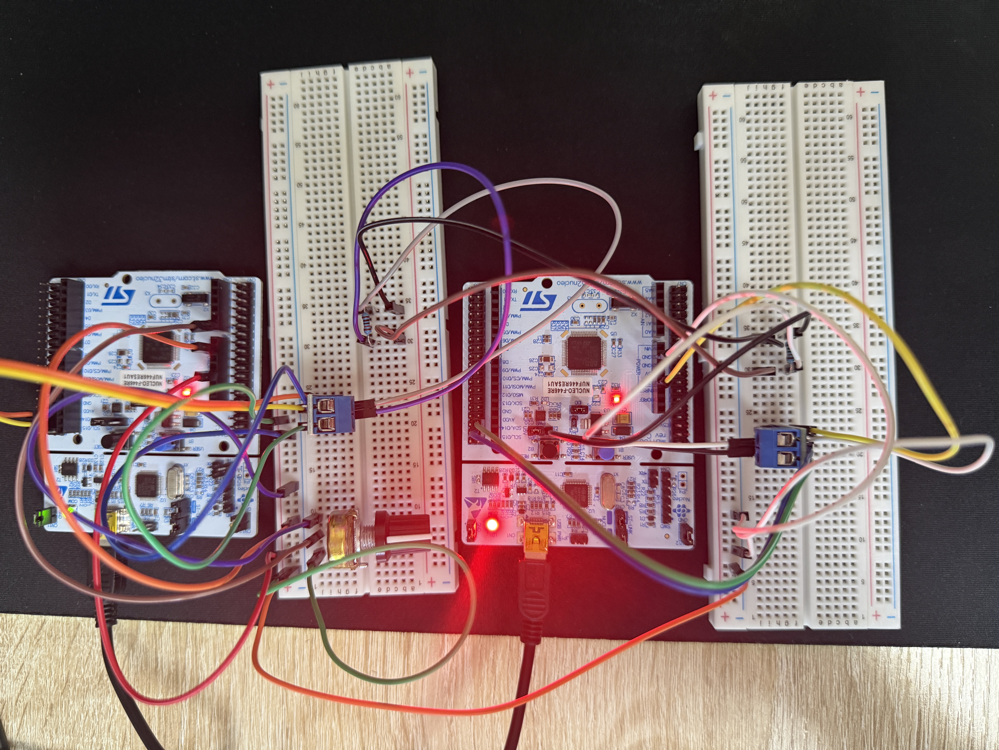

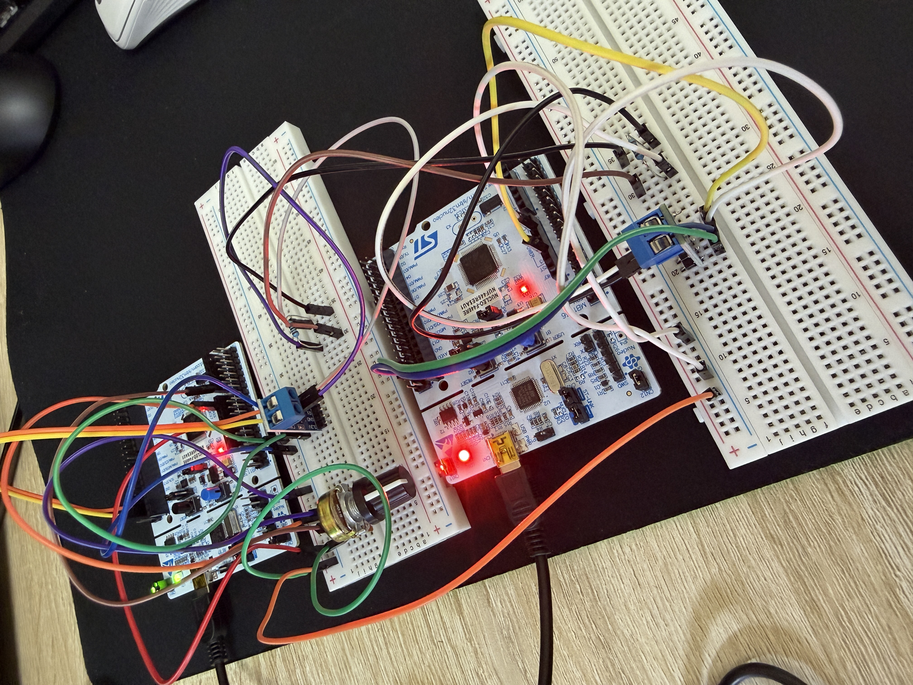

### Dashboard PWM Control Test

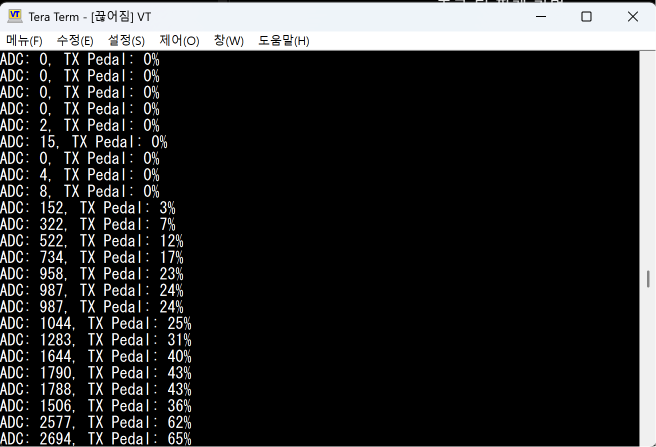

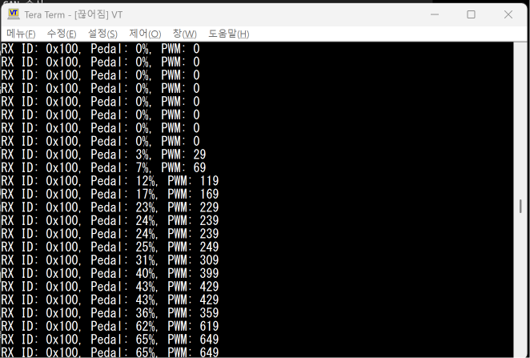

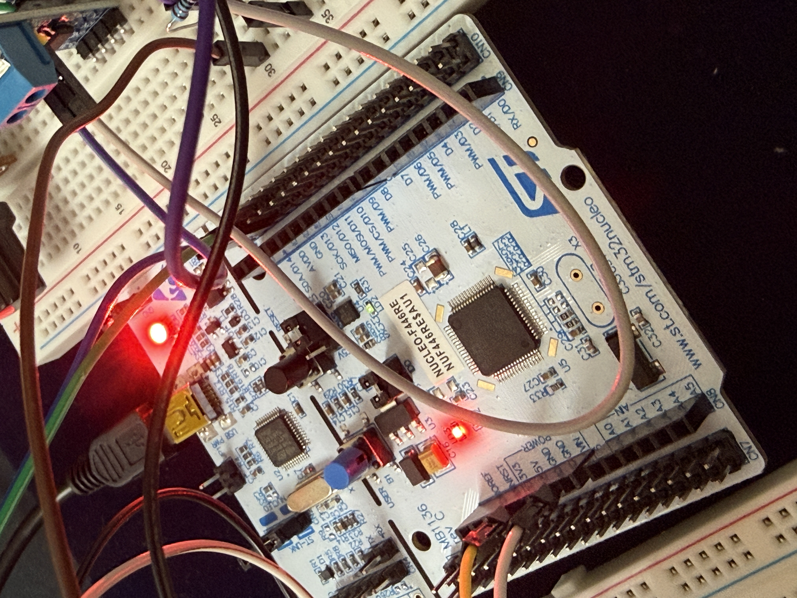

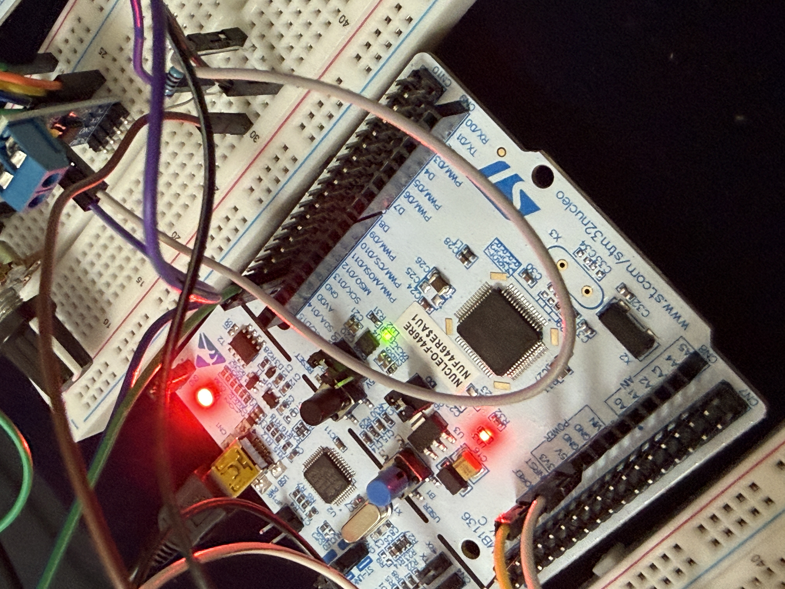

### CAN Timeout and Fail-safe Test

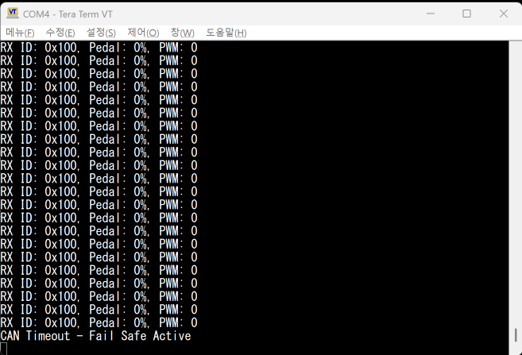

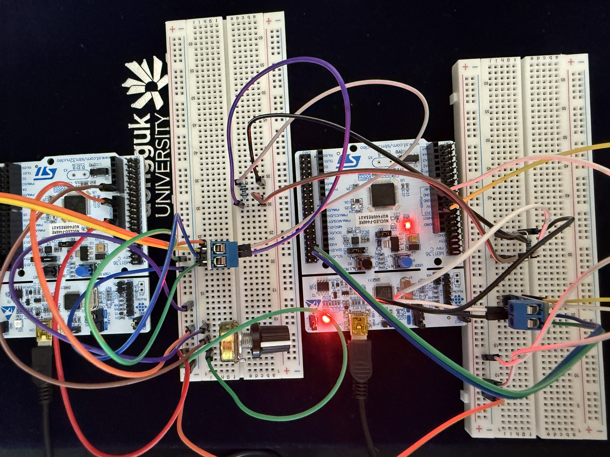

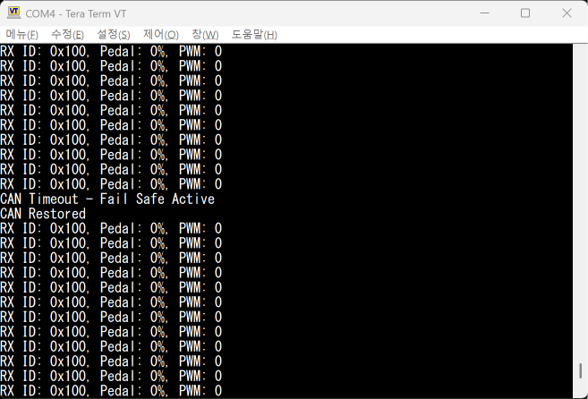

[Timeout Fail-safe Demo Video](images/07_timeout_failsafe_demo.mp4)

---

## Development Notes

- [UART Register Test](notes/01_uart_register_test.md)
- [UART ADC HAL Test](notes/02_uart_adc_hal_test.md)
- [ADC to Pedal Percent](notes/03_adc_to_pedal_percent.md)
- [PWM LED Control](notes/04_pwm_led_control.md)
- [CAN Pedal Value Transmission Test](notes/05_can_pedal_value_transmission.md)
- [Dashboard PWM Control Using Received CAN Data](notes/06_dashboard_pwm_control.md)
- [CAN Timeout and Fail-safe Test](notes/07_can_timeout_failsafe.md)
- [Non-blocking Pedal ECU CAN Transmission](notes/08_non_blocking_pedal_tx.md)
- [Non-blocking Dashboard ECU Receive and Timeout Loop](notes/09_non_blocking_dashboard_rx.md)

---

## Firmware

- [UART Register Test](firmware/uart_register_test/main.c)

- [Pedal ECU CAN TX Firmware](firmware/pedal_ecu_can_tx/main.c)
- [Pedal ECU CAN TX CubeMX Configuration](firmware/pedal_ecu_can_tx/pedal_ecu_can_tx.ioc)

- [Dashboard ECU CAN RX Firmware](firmware/dashboard_ecu_can_rx/main.c)
- [Dashboard ECU CAN RX CubeMX Configuration](firmware/dashboard_ecu_can_rx/dashboard_ecu_can_rx.ioc)

---

## Notes

The initial UART test was verified using direct register-level code.

The STM32 successfully transmitted `"Hello STM32"` to Tera Term via USART2.

The CAN communication test was successfully verified after moving the CAN TX/RX wires to the correct PB8/PB9 Morpho connector pins.

The Pedal ECU successfully transmitted ADC-based pedal percentage data over CAN, and the Dashboard ECU successfully received the CAN frame and printed the received value through UART.
