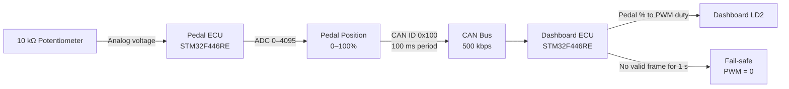
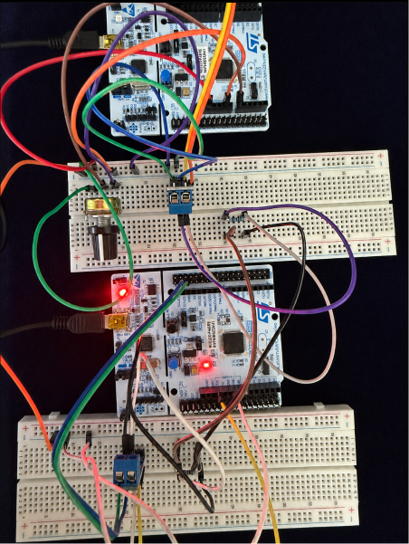
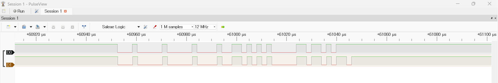
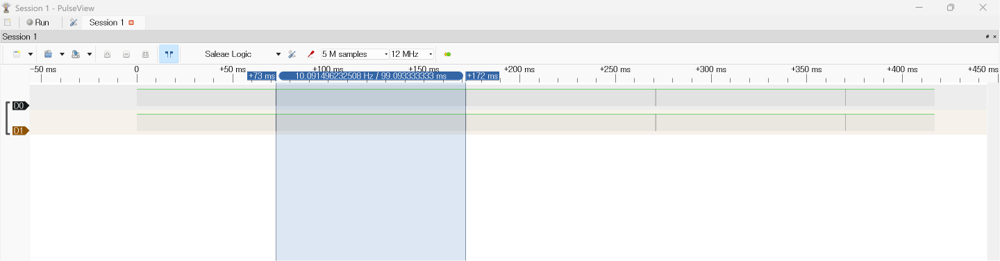
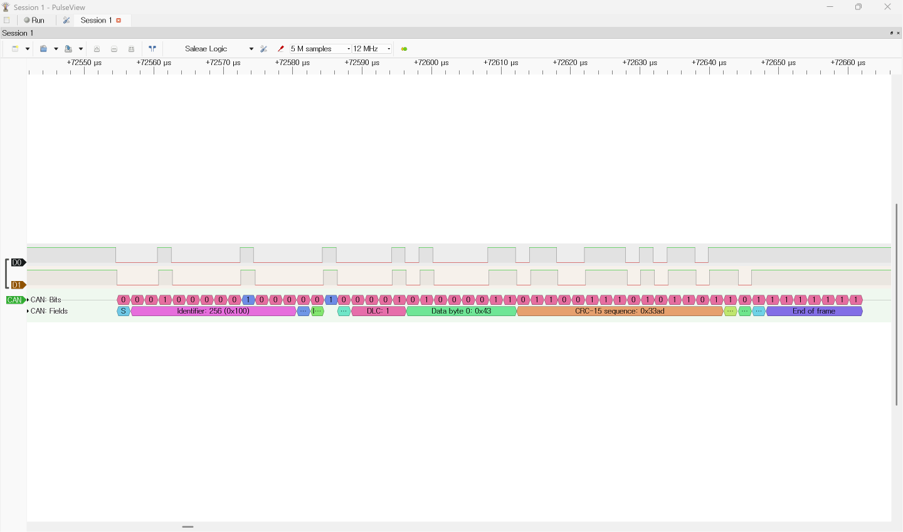

# STM32 CAN Pedal–Dashboard ECU Simulator

A two-node embedded system that reads a simulated accelerator-pedal input, transmits the pedal position over CAN, controls a dashboard LED using PWM, and activates fail-safe behavior when communication is lost.

## Project Overview

This project simulates a basic automotive in-vehicle communication system using two STM32 Nucleo-F446RE boards.

The **Pedal ECU** reads an analog pedal input through ADC, converts the measured value into a pedal percentage from 0% to 100%, and transmits the result periodically over CAN.

The **Dashboard ECU** receives the pedal message, controls the onboard LED brightness through PWM, detects CAN communication timeout, and forces the LED output to zero as a fail-safe action.

When CAN communication is restored, the Dashboard ECU automatically returns to normal operation.

---

## Hardware

- STM32 Nucleo-F446RE x2
- SN65HVD230 CAN Transceiver x2
- 10kΩ Potentiometer
- LED
- 120Ω termination resistor x2
- Breadboard and jumper wires
- Logic Analyzer

---

## Development Environment

- STM32CubeIDE
- STM32CubeMX
- Tera Term
- Windows

---

## Project Highlights

- Two STM32 Nucleo-F446RE boards operating as independent ECUs
- Analog pedal input measured using a 12-bit ADC
- Pedal position converted into a percentage from 0% to 100%
- Standard CAN communication at 500 kbps
- Pedal message transmitted every 100 ms
- Dashboard LED brightness controlled using PWM
- CAN timeout detection after 1 second without a valid message
- Fail-safe LED OFF behavior and automatic recovery
- Non-blocking super-loop structure using `HAL_GetTick()`
- CAN frame and transmission period verified using a logic analyzer

---

## System Architecture



### ECU Responsibilities

| ECU | Input | Processing | Output |
|---|---|---|---|
| Pedal ECU | Potentiometer through ADC | Converts the 12-bit ADC value into a pedal percentage and transmits it periodically | CAN message `0x100` |
| Dashboard ECU | CAN message `0x100` | Validates the pedal data, calculates PWM duty, and monitors communication timeout | LD2 brightness, UART logs, and fail-safe output |

---

## Implementation Status

- [x] UART debugging using register-level code and STM32 HAL
- [x] Analog pedal input measurement using ADC
- [x] Pedal percentage conversion from 0% to 100%
- [x] Dashboard LED brightness control using PWM
- [x] CAN transmission and reception between two ECUs
- [x] CAN timeout detection and fail-safe LED OFF behavior
- [x] Automatic recovery after CAN communication is restored
- [x] Non-blocking periodic processing using `HAL_GetTick()`
- [x] CAN waveform, transmission period, and frame verified using a logic analyzer
- [ ] Final integrated system demo

---

## CAN Message Specification

The Pedal ECU reads the potentiometer value through ADC, converts it into a pedal position from 0% to 100%, and transmits the result to the Dashboard ECU through CAN.

| Field | Specification |
|---|---|
| CAN frame type | Standard 11-bit identifier |
| CAN ID | `0x100` |
| Bitrate | 500 kbps |
| DLC | 1 byte |
| `Data[0]` | Pedal position from `0` to `100` |
| Transmission period | 100 ms |
| CAN TX pin | PB9 |
| CAN RX pin | PB8 |
| Timeout threshold | 1000 ms |

### Payload Example

```text
Data[0] = 0x43
0x43 = 67 decimal
Pedal position = 67%
```

The Dashboard ECU receives CAN message `0x100`, checks whether the pedal value is within the valid range of 0 to 100, and converts the received value into PWM duty.

The onboard LED brightness changes according to the received pedal position.

If no valid pedal message is received for more than 1000 ms, the Dashboard ECU activates the fail-safe state and forces the PWM duty to zero.

When a valid CAN message is received again, the fail-safe state is cleared and normal PWM control resumes.

---

## Verification Results

| Test Item | Result |
|---|---|
| ADC pedal input | Potentiometer value successfully converted into a pedal position from 0% to 100% |
| CAN transmission | Pedal ECU periodically transmitted CAN message `0x100` |
| CAN reception | Dashboard ECU successfully received and validated the pedal data |
| PWM control | Dashboard LD2 brightness changed according to the received pedal position |
| Timeout detection | Communication loss detected after approximately 1000 ms |
| Fail-safe behavior | PWM duty forced to zero and Dashboard LD2 turned off |
| Communication recovery | Normal PWM control resumed after receiving a valid CAN message |
| Transmission period | Logic analyzer measurement confirmed approximately 100 ms |
| CAN frame decoding | CAN ID `0x100`, DLC `1`, and pedal payload successfully decoded |
| TXD/RXD comparison | Matching CAN frame patterns observed between transmitter TXD and receiver RXD |

---

## Demo and Evidence

### CAN Timeout and Fail-safe

The Dashboard ECU detects communication loss after 1000 ms, forces the PWM duty to zero, and automatically resumes normal operation when CAN communication is restored.





[Watch the timeout and fail-safe demo video](images/07_timeout_failsafe_demo.mp4)

### Logic Analyzer Verification

The physical CAN signals were measured at the Pedal ECU transmitter TXD and Dashboard ECU receiver RXD.

#### TXD and RXD Comparison



#### Transmission Period

The measured interval between consecutive CAN frames was approximately 100 ms.



#### CAN Frame Decode

The logic analyzer decoded CAN ID `0x100`, DLC `1`, and the pedal-position payload.



<details>
<summary><strong>Additional Development Evidence</strong></summary>

### ADC Pedal Input


### CAN Transmission and Reception


### CAN Bus Wiring


### Dashboard PWM Control


</details>

---

## Development Notes

- [UART Register Test](notes/01_uart_register_test.md)
- [UART ADC HAL Test](notes/02_uart_adc_hal_test.md)
- [ADC to Pedal Percent](notes/03_adc_to_pedal_percent.md)
- [PWM LED Control](notes/04_pwm_led_control.md)
- [CAN Pedal Value Transmission Test](notes/05_can_pedal_value_transmission.md)
- [Dashboard PWM Control Using Received CAN Data](notes/06_dashboard_pwm_control.md)
- [CAN Timeout and Fail-safe Test](notes/07_can_timeout_failsafe.md)
- [Non-blocking Pedal ECU CAN Transmission](notes/08_non_blocking_pedal_tx.md)
- [Non-blocking Dashboard ECU Receive and Timeout Loop](notes/09_non_blocking_dashboard_rx.md)
- [CAN Logic Analyzer Verification](notes/10_logic_analyzer_verification.md)

---

## Firmware

- [UART Register Test](firmware/uart_register_test/main.c)

- [Pedal ECU CAN TX Firmware](firmware/pedal_ecu_can_tx/main.c)
- [Pedal ECU CAN TX CubeMX Configuration](firmware/pedal_ecu_can_tx/pedal_ecu_can_tx.ioc)

- [Dashboard ECU CAN RX Firmware](firmware/dashboard_ecu_can_rx/main.c)
- [Dashboard ECU CAN RX CubeMX Configuration](firmware/dashboard_ecu_can_rx/dashboard_ecu_can_rx.ioc)

---

## Technical Challenges and Solutions

| Challenge | Cause | Solution |
|---|---|---|
| CAN messages were not transmitted successfully | CAN TX/RX wires were connected to the wrong header pins | Moved the CAN connections to PB9 TX and PB8 RX on the Morpho connector |
| CAN communication was unstable | Incomplete bus wiring and termination | Connected a common ground and installed 120 Ω termination resistors at both ends of the CAN bus |
| Periodic transmission blocked other processing | The transmit loop used `HAL_Delay()` | Replaced the blocking delay with a `HAL_GetTick()`-based 100 ms scheduler |
| Dashboard output could retain stale pedal data | No communication-loss handling was implemented | Added a 1000 ms timeout and forced PWM duty to zero during the fail-safe state |
| Hardware behavior was difficult to confirm using UART alone | UART logs could not prove the physical CAN timing and frame contents | Measured TXD/RXD signals and decoded CAN ID, DLC, payload, and transmission period using a logic analyzer |
| The logic analyzer was not initially recognized correctly | An incompatible USB driver was installed | Installed the WinUSB driver and configured the FX2-based device in PulseView |

---
