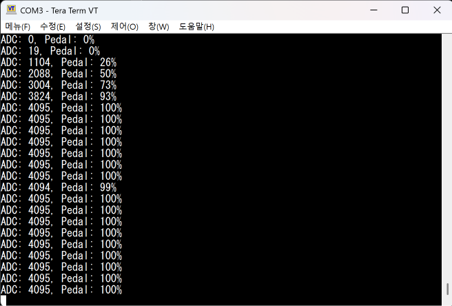

# 03. ADC to Pedal Percentage Conversion

## Goal

Convert the raw ADC value from the potentiometer into a pedal percentage value.

The ADC value ranges from 0 to 4095 because the STM32 ADC is configured as a 12-bit ADC.
This test converts the ADC value into a 0% to 100% pedal input value.

## Input

- Potentiometer connected to A0 / PA0 / ADC1_IN0
- ADC raw value range: 0 ~ 4095

## Conversion Formula

```c
pedal_percent = (adc_value * 100) / 4095;
```

## Result

The STM32 successfully reads the potentiometer input and prints both the raw ADC value and the converted pedal percentage through UART.

Example output:

```text
ADC: 0, Pedal: 0%
ADC: 1024, Pedal: 25%
ADC: 2048, Pedal: 50%
ADC: 3072, Pedal: 75%
ADC: 4095, Pedal: 100%
```

## Test Evidence

### Tera Term Output



## What I Learned

- A 12-bit ADC produces values from 0 to 4095.
- Raw ADC values can be scaled into meaningful engineering values.
- The potentiometer can be treated as a simple pedal input simulator.
- UART output is useful for debugging sensor values.

## Next Step

- Use the pedal percentage value to control LED brightness using PWM.
- Later, transmit the pedal percentage value through CAN.
